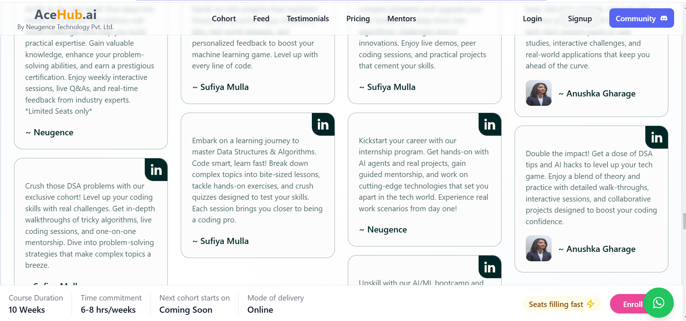
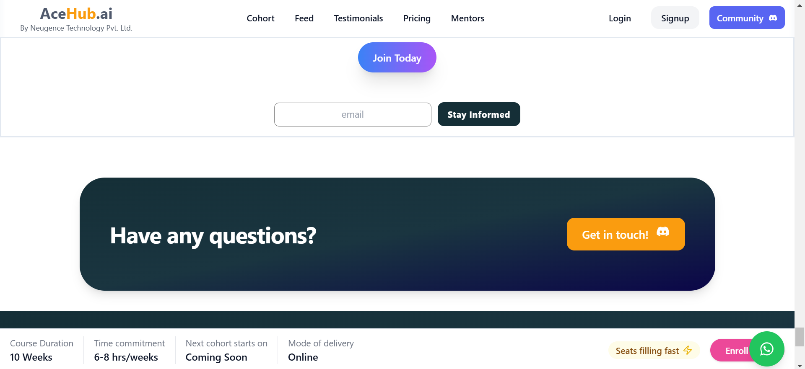
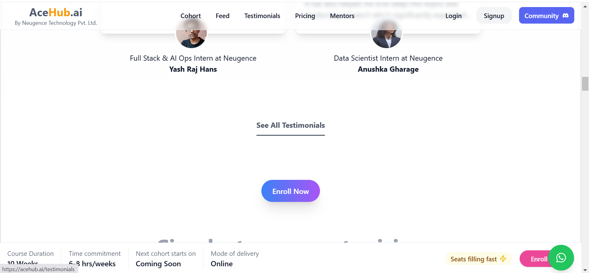

# UI/UX Analysis of AceHub.ai Landing Page  

## First Impressions as a User  

### What Stands Out?  
  
**Concise Messaging** – The main tagline clearly communicates the platform’s AI-driven capabilities without overwhelming the user.

**Engaging Animations & Effects** – Smooth transitions and micro-interactions make the page feel dynamic.  

##  What Feels Confusing or Needs Improvement?  
**Overwhelming Content Sections-Lacks Visual Hierarchy** – Some sections feel **text-heavy**, making it hard to skim quickly. More visual breaks or bullet points could enhance readability. 

**Lack of CTA Differentiation** – Some CTAs look similar in style, making it hard to distinguish primary actions from secondary or tertiary ones.

**Inconsistent Color Pallate and Typography** - The color scheme and typography feel inconsistent in some sections, which reduces brand cohesion and recall and makes the interface feel less polished. 

**Insufficient Contrast** – Some text blends into the background, making it hard to read. Poor contrast affects both usability and accessibility.

**Lack of Balance in Layout** – The design feels visually unbalanced, with some sections appearing too crowded while others have excessive whitespace. This disrupts the flow of information.

**Overcomplicated Design (Lack of Simplicity)** – Some sections contain unnecessary decorative elements that don’t contribute to the user’s understanding of the product. This clutters the experience and reduces clarity.

